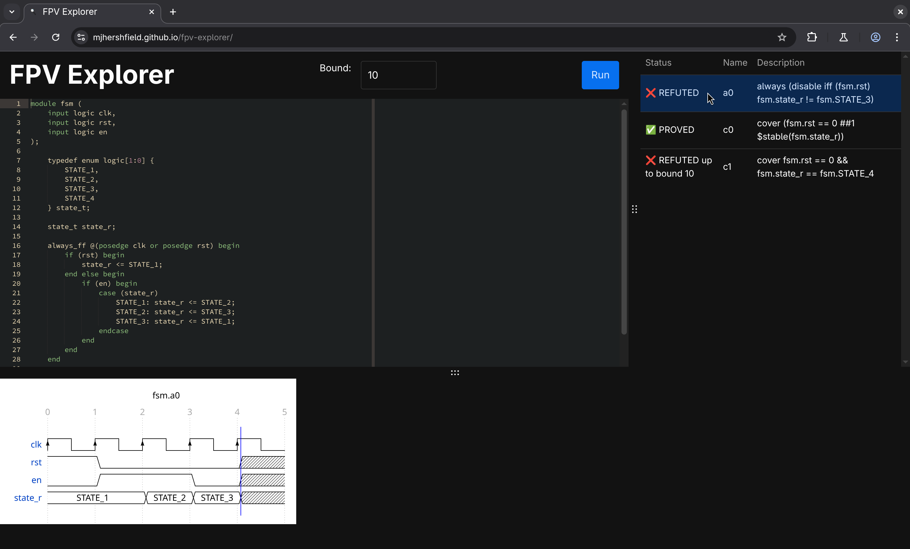

+++
date = '2025-06-29T15:31:12-07:00'
draft = false
title = 'FPV Explorer'
+++

During my internship at [Astera Labs](https://www.asteralabs.com/), I was tasked to formally verify
the modules that I designed to ensure that they would not be the cause of future debugging
headaches. In the process, myself and the other intern on my project became the second and third FV
engineers at Astera. When we were asked to help teach a lesson about FV to high schoolers with no
prior experience in digital design (or even programming in some cases), I created FPV Explorer as a
hands-on activity to keep the students excited and engaged in the lesson.

FPV Explorer is a client-side web application that allows anyone to play around with formally
verifying SystemVerilog code. It is heavily inspired by Daniel Kroening's
[EBMC on the Web](https://www.cprover.org/ebmc/web/).

FPV Explorer allows you to write synthesizable SystemVerilog and verify it with assertions,
assumptions, and cover properties all within the browser. All properties in your design are listed
in the right sidebar, and you can click on a property to view the simulation trace generated by EBMC
for the property. FPV Explorer runs entirely in the browser, and can be hosted statically.

Want to learn more? Check out FPV Explorer's [GitHub Repo](https://github.com/mjhershfield/fpv-explorer)
or [try it for yourself](https://mjhershfield.github.io/fpv-explorer/)!

